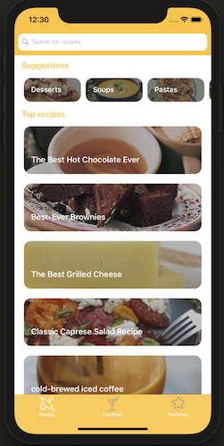
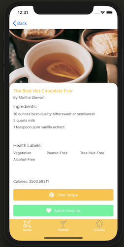
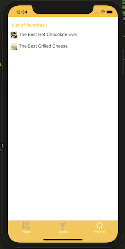
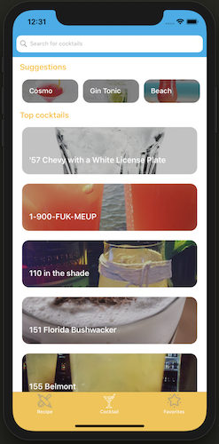

Cross-platform Xamarin.Forms Android/iOs app to fetch food and cocktails recipes using two APIs
 with database to save favorites.
 
#### Stack

- [Xamarin.Forms](https://docs.microsoft.com/en-us/xamarin/xamarin-forms/)

#### Design pattern

- [The Model-View-ViewModel Pattern - MVVM](https://docs.microsoft.com/en-us/xamarin/xamarin-forms/enterprise-application-patterns/mvvm)

#### APIs
- [TheCocktailDB API](https://www.thecocktaildb.com/api.php)
- [EDAMAM API](https://developer.edamam.com/)

#### Database

- [SQLite](https://docs.microsoft.com/en-us/xamarin/xamarin-forms/data-cloud/data/databases)

#### Screenshots

